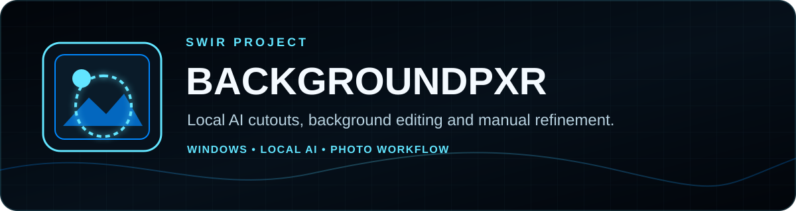
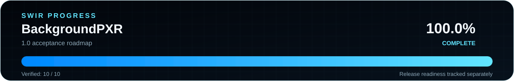
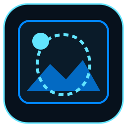

<!-- SWIR-README-STANDARD:v2 -->

<div align="center">



# BackgroundPXR

**Local AI background removal, replacement, blur and manual edge refinement for Windows.**


[](https://github.com/Swir)
[](https://github.com/Swir/BackgroundPXR/stargazers)

[**Highlights**](#-highlights) · [**Download**](#-quick-start) · [**Workflow**](#-workflow) · [**Progress**](#-progress) · [**Releases**](#-releases)

</div>


## 📍 Project Status

| Item | Status |
|---|---|
| Current line | **1.0.0rc1 — qualification candidate, not published** |
| Platform | Windows 10 / 11 |
| Processing | Local after the required AI model is available |
| Latest public release | [v0.4.0](https://github.com/Swir/BackgroundPXR/releases/tag/v0.4.0) |
| 1.0 acceptance progress | **70.0% — 7/10 verified items** |

<p align="center">
  
</p>

**1.0 acceptance progress: 70.0% (7/10).** The finite denominator is defined in [`ROADMAP_1_0.md`](ROADMAP_1_0.md). Release readiness remains separate and is currently **BLOCKED**.

**Qualification candidate:** development builds on this branch identify as **1.0.0rc1** so the exact portable package can be qualified before the final 1.0 promotion. It is not a GitHub Release; **v0.4.0 remains the latest public release** until the remaining quality gates pass.

## 🚀 Overview

**BackgroundPXR — AI Background Studio** is a Windows desktop application for removing and editing photo backgrounds without sending each image to a BackgroundPXR cloud service. It combines AI subject masks with manual cleanup, background replacement, blur, batch processing and export presets.

The AI model may need to be downloaded when first used. After the required model is available, image processing is performed locally on the computer.

## ✨ Highlights

| Feature | What it does |
|---|---|
| ✂️ AI Cutout | Creates a transparent subject mask using local AI processing. |
| 🖼️ Replace | Reuses the subject mask with a custom image or solid-color background. |
| 🌫️ Blur | Keeps the subject sharp while blurring the original background. |
| 💡 Studio | Produces a clean white-background result with optional soft shadow. |
| 🖌️ Manual Cleanup | Restore / Erase brushes, zoom, pan, undo/redo and cleanup helpers for difficult edges. |
| 🧑 Portrait & quality modes | High Quality v2, Quality, Fast and Portrait processing modes. |
| 📦 Batch workflow | Processes one or multiple images and supports custom output folders/suffixes. |
| 💾 Export | PNG transparency plus JPG and WebP output, with common canvas presets. |
| 🎯 Subject Transform | Scale and reposition the cutout without rerunning AI. |
| ✨ Outline / Sticker | Add a customizable outline for sticker-style and social graphics. |
| 🌑 Pro Shadow | Adjustable shadow opacity and blur for cleaner product/portrait compositions. |
| 🎭 Mask Preview & Export | Inspect the mask on black/white mattes or export the alpha mask as PNG. |
| 🧾 Diagnostics | Shows live processing state and records errors with tracebacks for troubleshooting. |

## ⚙️ Quick Start

### Recommended — Windows portable release

Download [BackgroundPXR v0.4.0](https://github.com/Swir/BackgroundPXR/releases/tag/v0.4.0), then:

1. Download `BackgroundPXR-0.4.0-Windows.zip`.
2. Extract the archive to a normal folder.
3. Run `BackgroundPXR.exe` from the extracted application folder.
4. Add an image, choose a Studio mode and AI quality mode.
5. Review the cutout, refine difficult edges if needed, then export.

The packaged Windows release does not require a separate Python installation.

### From source

```powershell
git clone https://github.com/Swir/BackgroundPXR.git
cd BackgroundPXR
py -3.12 -m venv .venv
.\.venv\Scripts\Activate.ps1
python -m pip install --upgrade pip
pip install -r requirements.txt
python app.py
```

An Internet connection may be needed for the first download of a required AI model.

## 📋 Requirements / Compatibility

| Component | Current scope |
|---|---|
| Primary OS | Windows 10 / 11 |
| Source runtime | Python 3.12 in the project workflow |
| AI/runtime packages | Installed from `requirements.txt`; release checks cover the bundled `rembg` / `pymatting` / `onnxruntime` runtime path |
| GUI | CustomTkinter/Tk-based desktop interface |
| Release packaging | PyInstaller portable folder inside a ZIP |

The application is designed around Windows. Repository checks do not establish a supported packaged Linux/macOS release.

## 🎮 Workflow

### Studio modes

| Mode | Purpose |
|---|---|
| **Cutout** | Transparent subject output |
| **Replace** | Custom image or solid-color background |
| **Blur** | Blur the original background behind the subject |
| **Studio** | White studio-style base with optional soft shadow |

### Studio Pro inspector

The Studio Pro line uses a cleaner three-page inspector: **AI / CREATE / EXPORT**. Creative controls no longer have to compete for vertical space in one long panel.

- scale and position the subject after AI processing;
- add a custom-color outline / sticker border;
- control shadow opacity and blur;
- preview result, grayscale mask, black matte or white matte;
- export the current refined mask as PNG;
- use Sticker, Product and Portrait style presets.

### Manual refinement

- **Restore brush** brings back subject areas removed by the AI mask.
- **Erase brush** removes remaining background areas.
- Brush size/hardness, zoom up to 800%, pan/Fit view and Undo/Redo support precise corrections.
- Smart Cleanup, Remove Leftovers and Reset Mask provide additional mask operations.

### Background and export options

- transparent, white or custom-color background;
- custom replacement image;
- blurred original background;
- soft shadow, auto crop and padding controls;
- PNG / JPG / WebP export;
- Original, 1:1, 4:5, 9:16, 16:9 and Product 2000×2000 canvas presets.

## ⌨️ Keyboard Shortcuts

| Shortcut | Action |
|---|---|
| `Ctrl + Z` | Undo |
| `Ctrl + Y` | Redo |
| `Ctrl + +` | Zoom in |
| `Ctrl + -` | Zoom out |
| `F6` | Show / hide thumbnail strip |
| `Alt + 1` | Cutout mode |
| `Alt + 2` | Replace mode |
| `Alt + 3` | Blur mode |
| `Alt + 4` | Studio mode |

## 🔒 Privacy & Local Processing

- No BackgroundPXR account is required by the application.
- Photos are processed locally after the required model is present.
- The editor does not require uploading source images to a BackgroundPXR server.
- Settings and diagnostic information are stored locally.

The initial AI-model download is separate from photo processing; an Internet connection can therefore still be required before a model is cached locally.

## 🧠 Technology / Project Structure

| Area | Repository path / role |
|---|---|
| Entry point | `app.py` |
| Processing | `backgroundpxr/engine.py` |
| Manual mask editing | `backgroundpxr/editor.py` |
| Diagnostics | `backgroundpxr/diagnostics.py` |
| Localization | `backgroundpxr/i18n.py` |
| UI | `backgroundpxr/ui.py` and Studio/UI modules |
| Packaging | `BackgroundPXR.spec` + `.github/workflows/windows.yml` |
| Tests | `tests/` unit/static/runtime tests and Windows GUI smoke |

## 🗺️ Progress

The canonical finite 1.0 acceptance scope is maintained in [`ROADMAP_1_0.md`](ROADMAP_1_0.md).

**Current verified progress: 7 / 10 = 70.0%.** The percentage measures acceptance work toward 1.0; it is not an AI cutout-accuracy score and does not by itself mean the Release gate has passed.

`tools/readme_progress.py` derives the card and roadmap mini directly from that checklist:

```powershell
python tools/readme_progress.py
python tools/readme_progress.py --check
```

## 🧪 Release Quality Checks

The Windows workflow runs on pull requests and pushes. Its test job currently performs:

- Python syntax compilation;
- unit tests;
- the fixed 1600×900 GUI acceptance gate;
- Windows 125%/150% scaling checks and reduced-size resize/HiDPI coverage.

Qualification and release builds additionally package the application, verify bundled runtime metadata, run the frozen AI-runtime self-test, create the ZIP and SHA-256 sidecar, and verify `BUILD_INFO.txt` against the exact Git commit that produced the artifact. Public release-triggered pushes are restricted to `main`, and prerelease versions such as `1.0.0rc1` are rejected by the final-release policy.

## 📦 Releases

Latest public release: **[v0.4.0](https://github.com/Swir/BackgroundPXR/releases/tag/v0.4.0)**, published September 10, 2026. It provides `BackgroundPXR-0.4.0-Windows.zip` and its SHA-256 sidecar.

[**Browse all releases →**](https://github.com/Swir/BackgroundPXR/releases)

## ⚠️ Limitations

- AI segmentation is probabilistic; hair, fur, glass, smoke, semi-transparent materials and low-contrast edges can need manual correction.
- Always inspect important exports before publishing them.
- Model availability/downloads can affect first-run readiness.
- A successful automated test does not guarantee a perfect cutout for every photograph.
- The repository currently has no `LICENSE` file; this documentation migration does not change licensing terms.

## 🇵🇱 Polski — skrót

**BackgroundPXR** to aplikacja dla Windows 10/11 do lokalnego usuwania i edycji tła zdjęć przy użyciu AI. Oferuje tryby **Wytnij / Podmień / Rozmyj / Studio**, przezroczyste PNG, własne tło lub kolor, alpha matting, ręczne narzędzia **Przywróć / Usuń**, zoom do 800%, Cofnij/Ponów, batch i eksport PNG/JPG/WebP. Po pobraniu potrzebnego modelu zdjęcia są przetwarzane lokalnie.

Kandydat **1.0.0rc1** służy wyłącznie do kwalifikacji pakietu 1.0; aktualną publiczną wersją pozostaje **[BackgroundPXR v0.4.0](https://github.com/Swir/BackgroundPXR/releases/tag/v0.4.0)**.

## 🔎 Search Keywords

`AI background remover Windows` • `offline background remover` • `local AI photo editor` • `transparent PNG maker` • `product photo background remover` • `portrait background remover` • `batch background removal` • `manual mask editor` • `background replacement tool` • `blur photo background` • `alpha matting Windows` • `local image cutout` • `Windows photo background studio` • `remove background without upload` • `sticker maker Windows` • `PNG mask export` • `subject positioning photo editor` • `AI product photo editor` • `outline cutout tool`


<div align="center">



### `REMOVE • REFINE • CREATE`

**BackgroundPXR — Power eXtreme Remover, by Swir**

[**← SWIR profile**](https://github.com/Swir) · [**All projects →**](https://github.com/Swir?tab=repositories) · [**Report an issue**](https://github.com/Swir/BackgroundPXR/issues)

</div>
