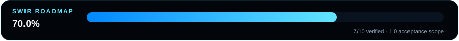

# BackgroundPXR 1.0 Roadmap

<!-- SWIR-PROGRESS-SVG-PRO:v1 -->

  

**1.0 acceptance progress: 10 / 10 = 100.0%.**  
**Release readiness: COMPLETE** — BackgroundPXR v1.0.0 was published from exact source `d9bad0748e5d15c91c563a6946e7cc85c3e9cc39`; the Windows ZIP/checksum, frozen runtime and fresh-download post-release smoke verification all passed.

This is the canonical finite denominator for the path to BackgroundPXR 1.0. It measures verified acceptance work, not image-cutout accuracy and not a promise of release timing.

## Canonical 1.0 acceptance scope

- [x] Local AI processing core and supported processing modes are implemented with engine-level regression coverage.
- [x] Manual mask refinement supports Restore/Erase, cleanup operations and Undo/Redo with regression coverage.
- [x] Studio Pro composition supports Cutout/Replace/Blur/Studio, subject transform, outline/shadow and mask preview/export.
- [x] Import/batch/export plumbing supports image collection, PNG/JPG/WebP output, filename suffixes and documented canvas presets.
- [x] Local diagnostics and the maintained PL/EN interface foundation are implemented and covered by targeted tests.
- [x] The 1600×900 Windows GUI smoke gate verifies readable sidebars, unclipped inspector pages, usable controls and core Studio Pro wiring.
- [x] Complete the dedicated HiDPI/resize/manual UX acceptance pass across the supported Windows scaling range and resolve any regressions found.
- [x] Build and verify an exact 1.0 release-candidate portable package, including the frozen AI-runtime self-test and checksum.
- [x] Complete the final 1.0 functional/regression/manual-workflow gate with no known critical release-blocking defects.
- [x] Publish the final 1.0 Windows package with release notes/checksum and complete post-release smoke verification.

## Completion evidence

- Public release: [BackgroundPXR v1.0.0](https://github.com/Swir/BackgroundPXR/releases/tag/v1.0.0)
- Release source: `d9bad0748e5d15c91c563a6946e7cc85c3e9cc39`
- Release assets: `BackgroundPXR-1.0.0-Windows.zip` plus SHA-256 sidecar
- Final workflow: package provenance verification, frozen-runtime self-test, public fresh-download verification and post-release smoke all green

## Progress rules

- The percentage is derived only from the checklist above: checked items divided by all ten items.
- Cosmetic/documentation-only work does not mark an acceptance item complete.
- A green source CI run is not by itself a 1.0 Release.
- Release readiness remains separate from the numeric development/acceptance progress.
- When scope changes materially, update this checklist first, then regenerate the SVG assets with `python tools/readme_progress.py`.
